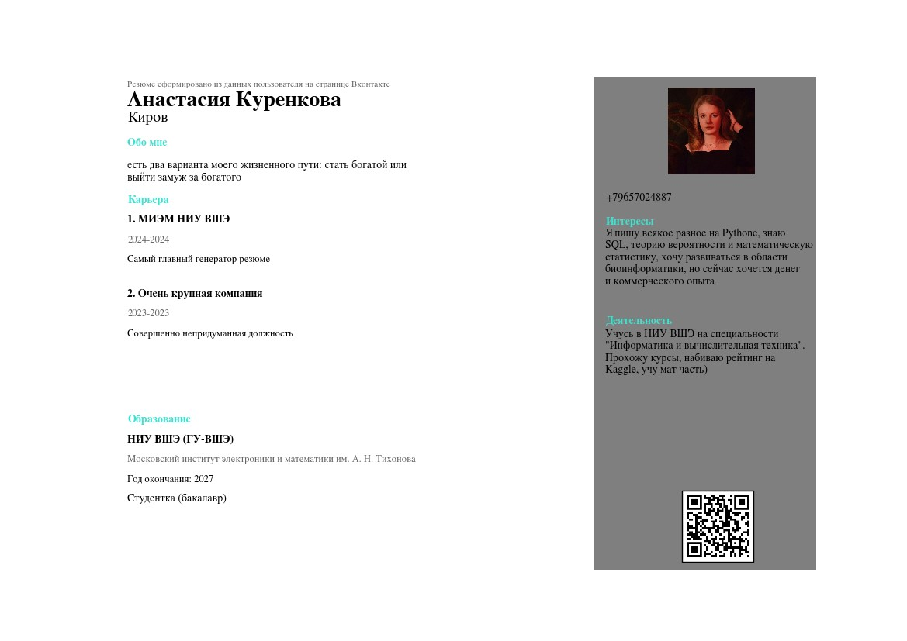

# Генерация резюме из ВК
Это программа позволяет генерировать резюме в формате PNG и PDF, используя только ваш токен от страницы "Вконтакте"
## Пример резюме

Заранее предупрежу, что данные берутся из полей "Карьера", "Образование", "Обо мне", "Интересы", "Деятельность"
Так что если вы не хотите, чтобы какие-то поля в вашем резюме были предательски пустыми, то заполните это на своей странице в вк)

## Ваши действия, чтобы начать пользоваться программой

1. Клонируем репозиторий на локал  
Прописать в командной строке `git clone https://git.miem.hse.ru/biv23x-ps/aakurenkova_5.git`
2. Усанавливаем все библиотеки  
Прописать в командной строке `pip install -r requirements.txt`
3. Получаем токен свой страницы вконтакте 
Переходи на [сайт](https://vkhost.github.io/), следуем интрукциям оттуда, копируем токен, вставляем его в [config.txt](config.txt)
4. Выбираем цвет заголовков в резюме:
   1. бордовый
   2. чёрный
   3. бирюзовый
   4. салатовый
   5. синий
   6. фиолетовый 
Копируем название цвета и вставляем в файл [color.txt](color.txt)
5. Запускаем программу и радуемся резюме(Сохранится в формате PDF и PNG с название "Резюме Имя Фамилия") со своей фотографией и QR-кодом со ссылкой на страницу в вк

